# NutriFit

## Descrição do Sistema

O NutriFit é um sistema web de acompanhamento nutricional e treinos personalizados.
A plataforma permite que administradores gerenciem clientes, exercícios e fichas de treino,
enquanto os clientes acompanham suas metas, refeições, cálculo de TMB e evolução física
diretamente pelo sistema.

---

## Integrantes do Grupo

- Matheus Silveira de Carvalho
- Bruno Esteves dos Reis Marinho

---

## Tecnologias Utilizadas

- Java 25
- Spring Boot 4.0.6
- Spring Security 7
- Spring Data JPA
- Thymeleaf + Thymeleaf Extras Spring Security
- Hibernate 7
- MySQL 8 (produção)
- H2 (desenvolvimento)
- Lombok
- Maven

---

## Instruções de Execução

### Pré-requisitos

- Java 25 instalado
- MySQL 8 rodando localmente
- IntelliJ IDEA

### Banco de dados

Crie o banco de dados no MySQL:

```sql
CREATE DATABASE nutrifitDB;
```

Crie um usuário administrador manualmente (senha: `123`):

```sql
INSERT INTO usuario (dtype, login, nome, senha) VALUES
('Admin', 'admin', 'Administrador', '$2a$10$EL6KZmqzgokfcQuff1KfBeB1DzRpuN6TvLm81L650z6/Y4BlnUGQu');
```

### Executando o projeto

1. Abra o projeto no IntelliJ IDEA
2. Certifique-se de que o JDK 25 está configurado no projeto
3. Abra o arquivo `NutrifitApplication.java`
4. Clique no botão de play ao lado do método `main` para executar
5. Acesse em: `http://localhost:9000`


---

## Funcionalidades Implementadas

- Login e autenticação com dois perfis: Administrador e Cliente
- Dashboard personalizado por perfil
- Gerenciamento de clientes — cadastro, listagem e exclusão (ADMIN)
- Gerenciamento de exercícios — cadastro, listagem e exclusão (ADMIN)
- Fichas de treino — criação com múltiplos exercícios, visualização e exclusão
- Marcar exercícios como feitos na ficha de treino (CLIENTE)
- Controle de refeições — cadastro e listagem com cálculo de calorias diárias (CLIENTE)
- Acompanhamento de metas — cadastro com tipo e peso alvo, visualização de status
- Cálculo de TMB e necessidade calórica diária (CLIENTE)
- Editar perfil — cliente pode atualizar seus dados pessoais e peso
- Validações nos formulários com campos obrigatórios e limites numéricos

---

## Funcionalidade Extra — Calculadora de TMB e Necessidade Calórica

A funcionalidade tem como objetivo calcular a Taxa Metabólica Basal (TMB) do usuário,
ou seja, quantas calorias o corpo gasta em repouso. Com base nas informações de gênero,
peso, altura e idade, o sistema realiza o cálculo e retorna o valor do TMB.

Além disso, o usuário informa seu nível de atividade física — sedentário, levemente ativo,
moderadamente ativo, muito ativo ou extremamente ativo — e o sistema calcula a necessidade
calórica diária, auxiliando o usuário a manter uma alimentação adequada e evitar déficits
calóricos elevados que possam causar perda de massa muscular ou fraqueza.

---

## Prints do Sistema

### Tela de Login
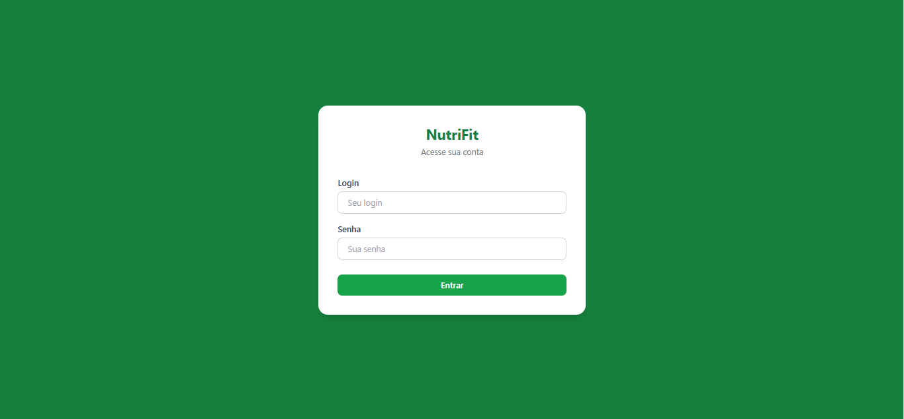

### Cadastro de Login


### Dashboard Administrador
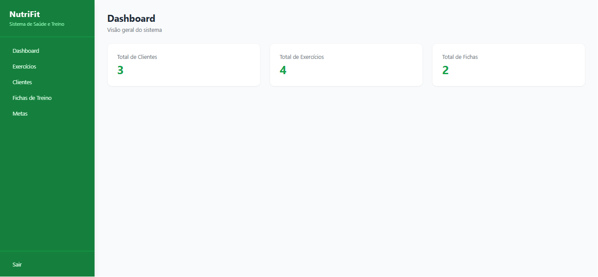

### Dashboard Cliente
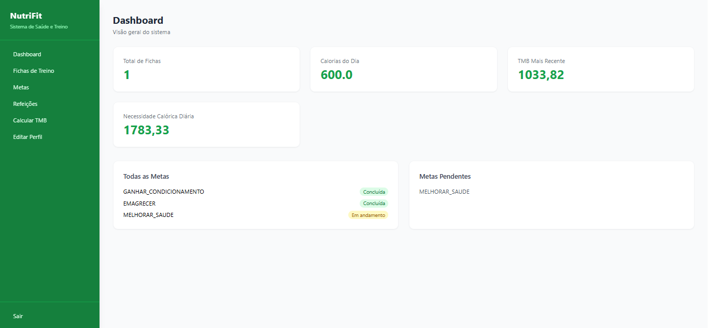

### Cadastro de Novo Cliente


### Listagem de Clientes
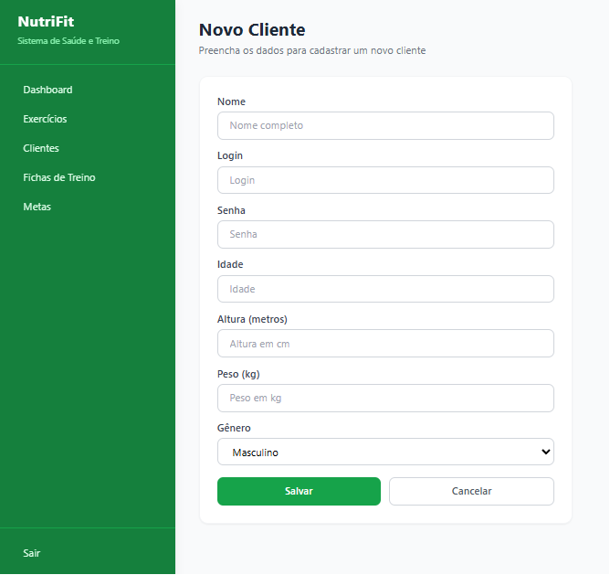

### Cadastro de Exercício
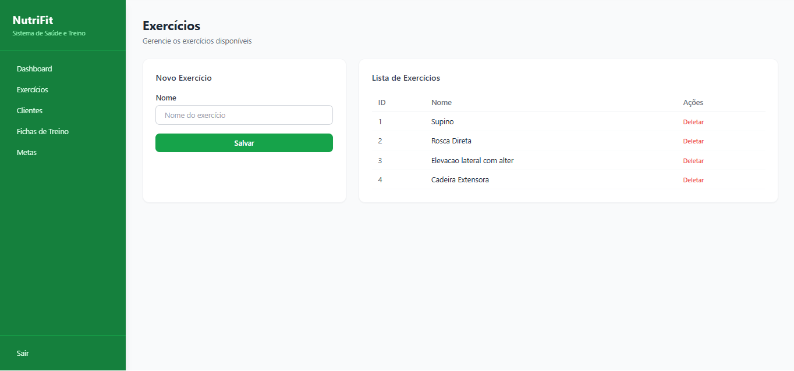

### Listagem de Exercícios (ADMIN)
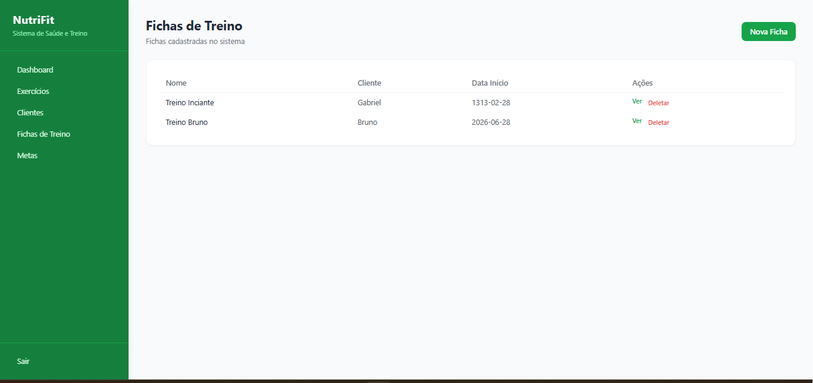

### Visualização de Ficha (ADMIN)
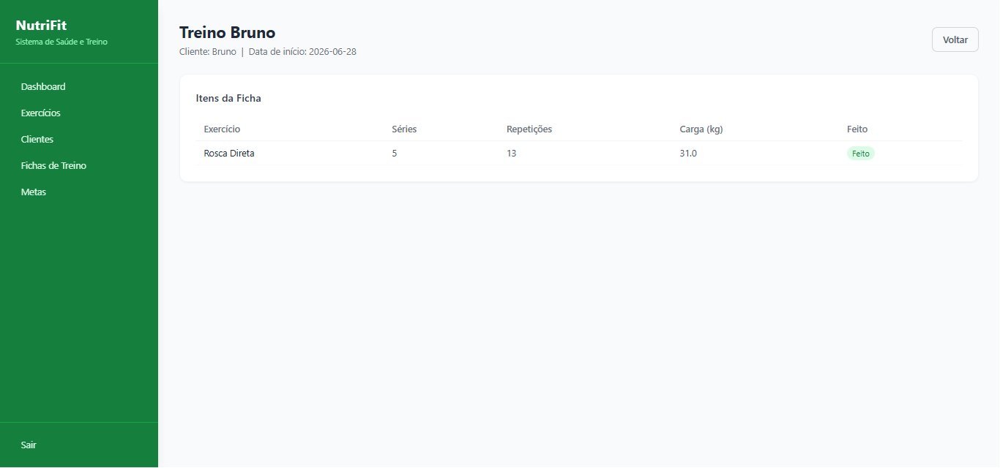

### Formulário de Cadastro de Meta
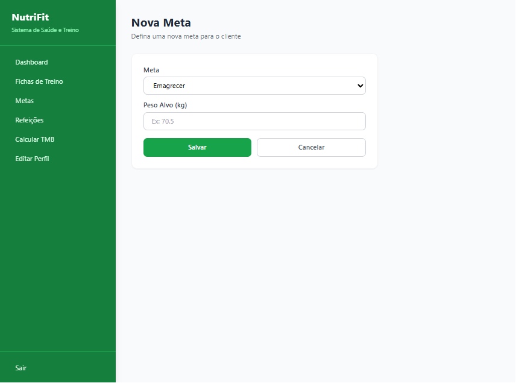

### Listagem de Metas (CLIENTE)
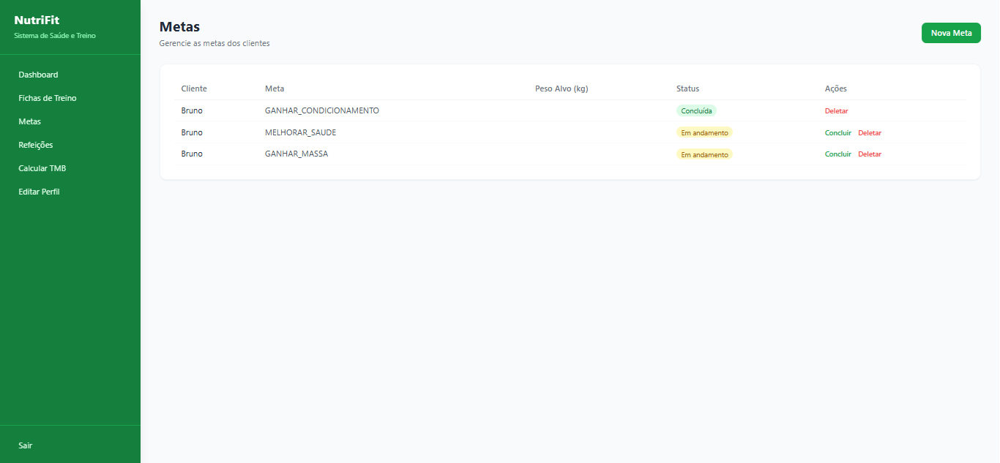

### Calcular TMB
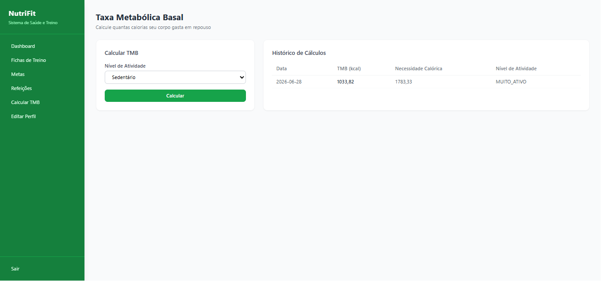

### Editar Perfil do Cliente
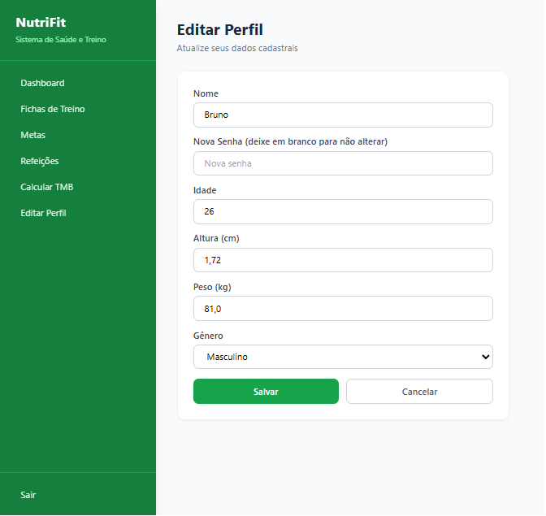
